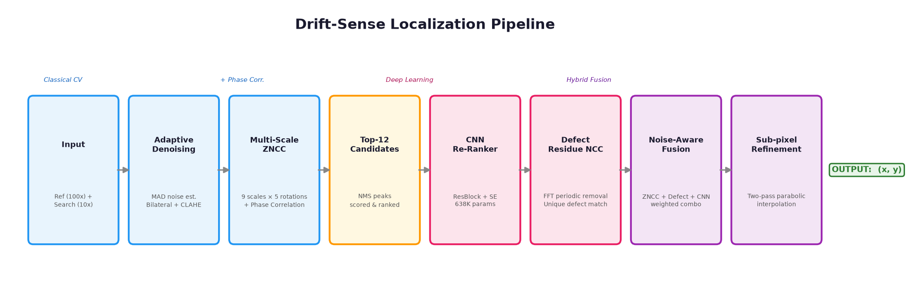
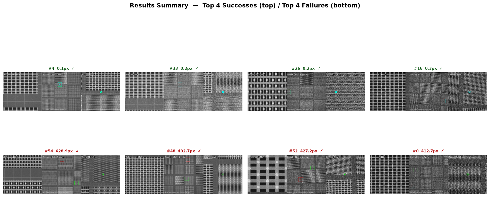
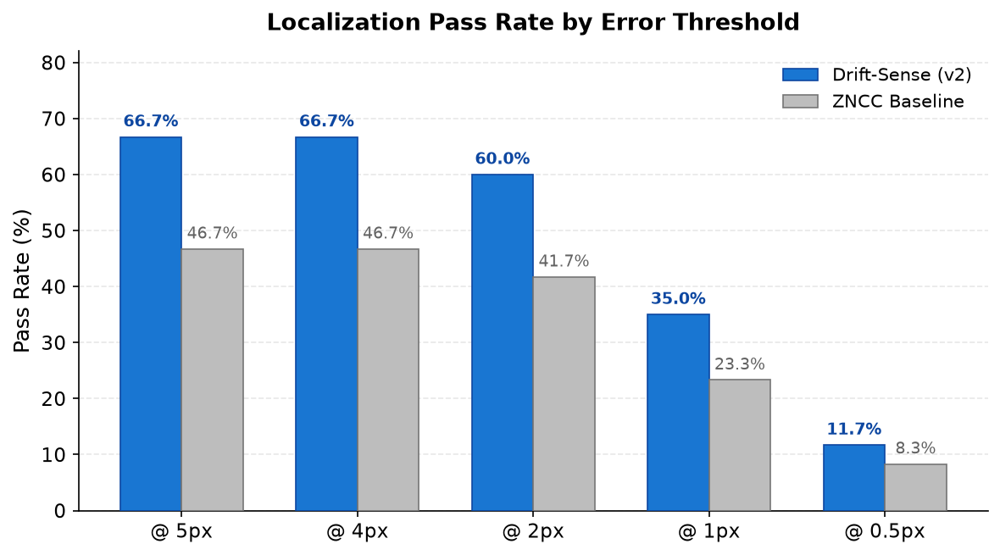
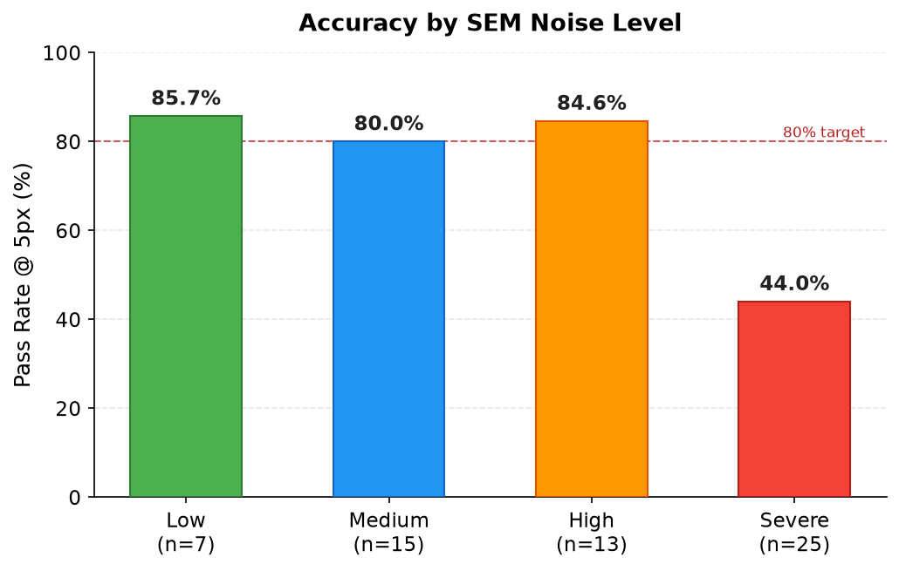
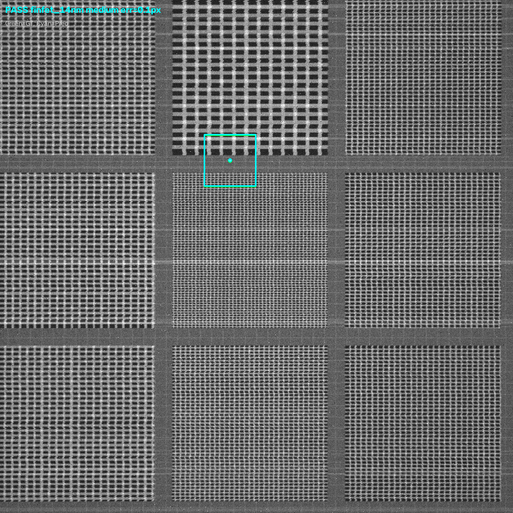
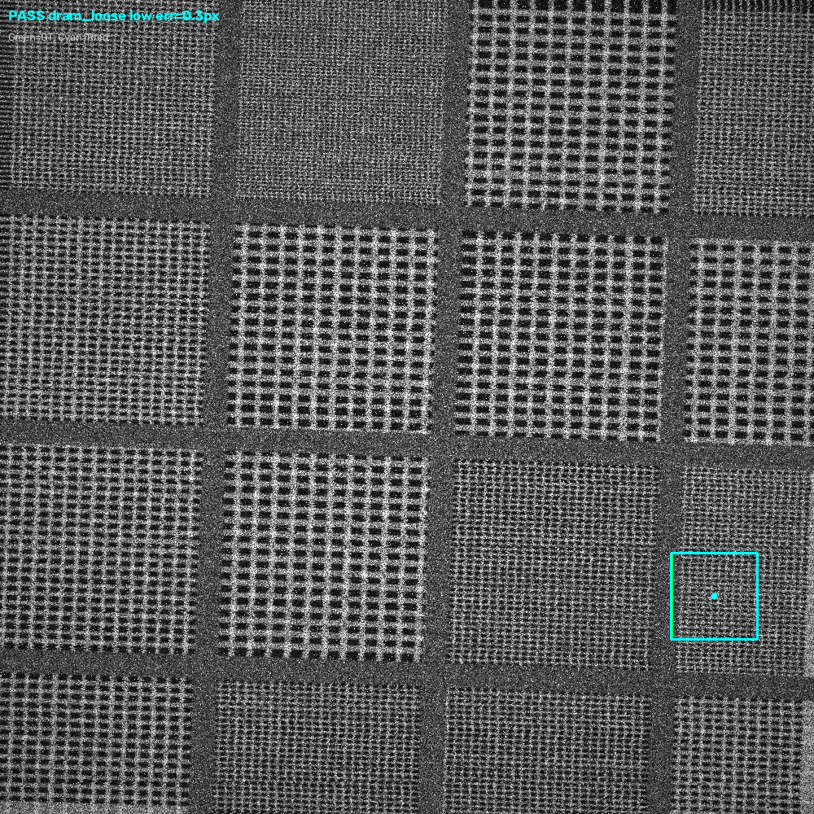
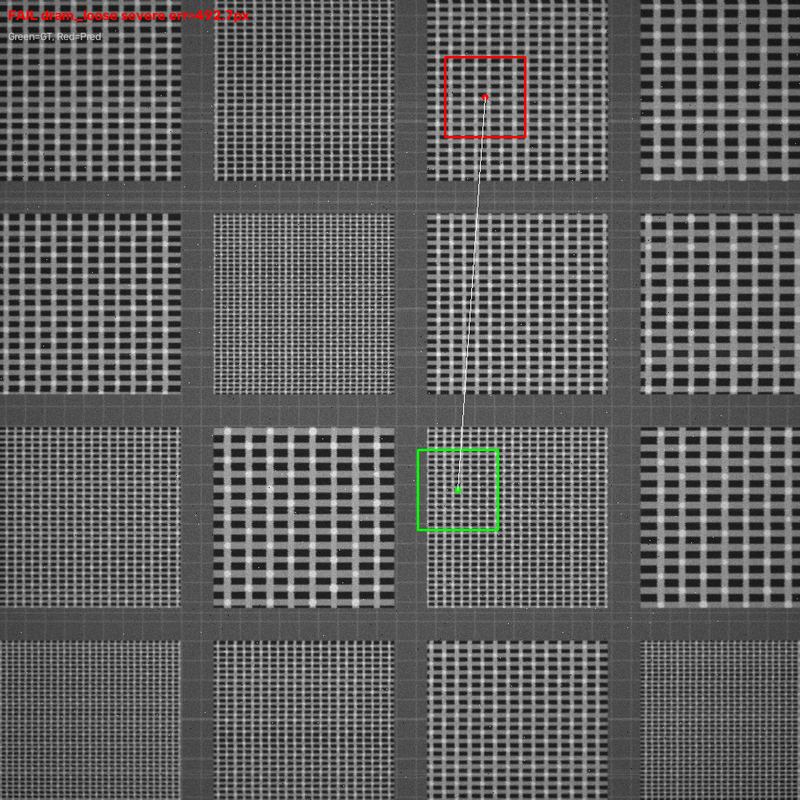
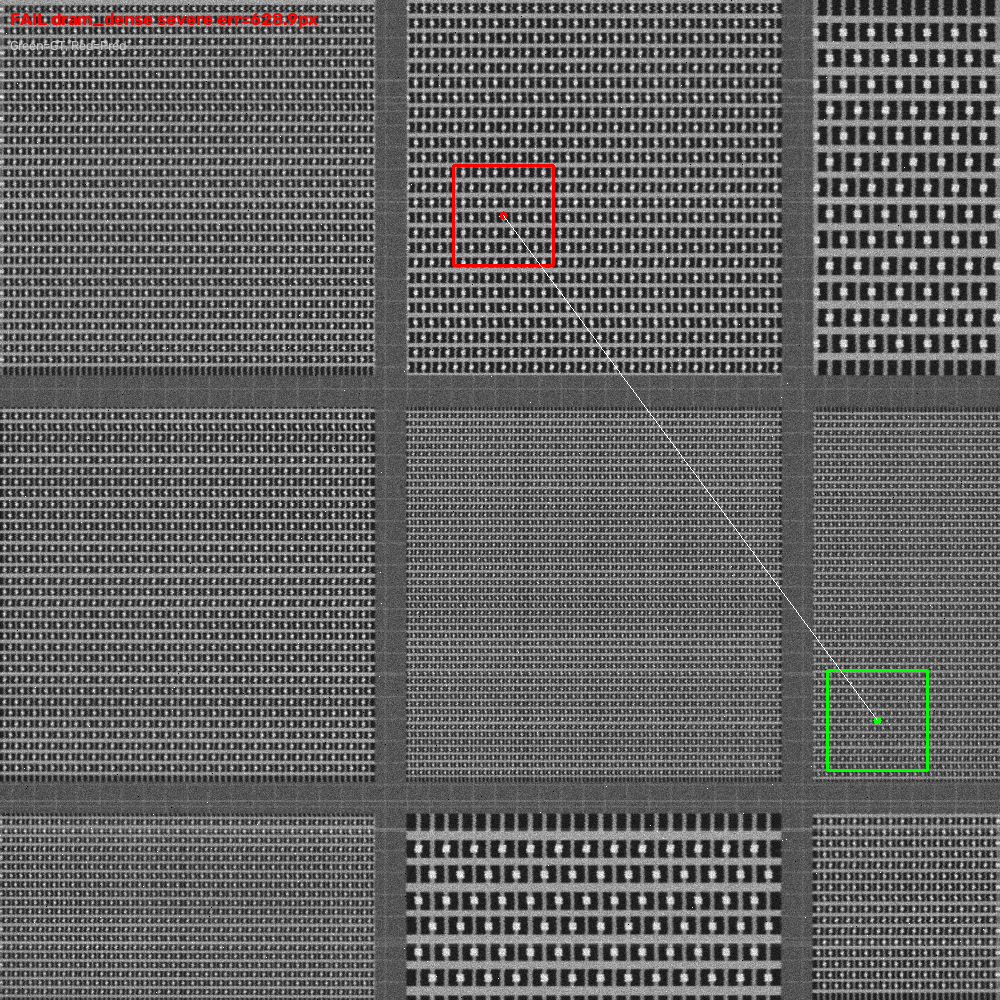
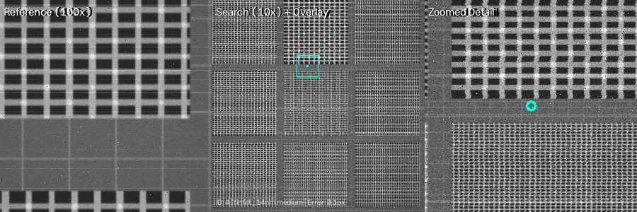
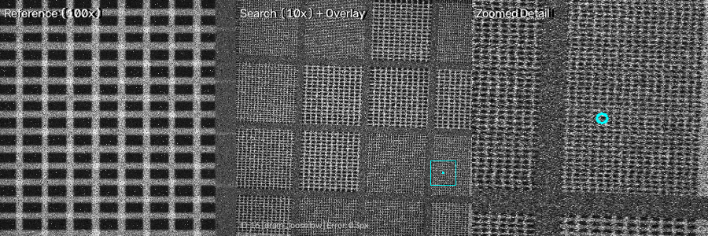

# Drift-Sense: AI-Powered Navigation Error Recovery for Wafer Inspection Tools

Given a **1000×1000 100× reference** image and a **1000×1000 10× search** image
(~10:1 scale, ±2° rotation, SEM noise), find the precise centre `(x, y)` of the
reference pattern inside the search image.

---

## Pipeline Overview



**8 stages**: Input → Adaptive Denoising → Multi-Scale ZNCC (9 scales × 5 rotations = 45 variants)
→ Phase Correlation Seed → Top-12 Candidates → CNN Re-Ranker (ResBlock+SE, 638K params)
→ Defect Residue NCC → Noise-Aware Fusion + Sub-Pixel Refinement

---

## Results



| Metric | Model | Classical Baseline | Improvement |
|--------|-------|-------------------|-------------|
| **Pass Rate @ 5px** | **66.7%** (40/60) | 46.7% (28/60) | **+20.0pp** |
| Pass Rate @ 2px | 60.0% (36/60) | 41.7% | +18.3pp |
| Pass Rate @ 1px | 35.0% (21/60) | 23.3% | +11.7pp |
| Mean Error | 61.9 px | 95.5 px | −35% |
| Median Error | 1.5 px | 22.4 px | −93% |



### Performance by Noise Level



| Noise | Samples | Pass @ 5px | Mean Error |
|-------|---------|------------|------------|
| Low | 7 | **85.7%** | 2.0 px |
| Medium | 15 | **80.0%** | 44.9 px |
| High | 13 | **84.6%** | 5.5 px |
| Severe | 25 | **44.0%** | 118.2 px |

---

## ZNCC Prediction Details

Each localization produces a ZNCC score, CNN probability, matched scale,
and rotation angle. Below are the key predictions:

### Success Cases — high ZNCC score + correct scale

| ID | Scale | Rot | ZNCC | CNN | Error | Arch | Noise |
|----|-------|-----|------|-----|-------|------|-------|
| 4 | 10.0x | 0.0° | **0.858** | 0.595 | **0.07px** | FinFET 14nm | Medium |
| 33 | 11.0x | 0.0° | **0.792** | 0.591 | **0.18px** | DRAM 1x | High |
| 26 | 10.0x | 2.0° | **0.899** | 0.590 | **0.18px** | FinFET 14nm | Medium |
| 16 | 9.5x | 0.0° | **0.955** | 0.598 | **0.28px** | DRAM Loose | Low |
| 56 | 10.0x | 0.0° | **0.832** | 0.577 | **0.30px** | FinFET 14nm | Medium |
| 14 | 9.0x | 2.0° | **0.797** | 0.568 | **0.31px** | FinFET 7nm | Severe |
| 24 | 10.0x | 0.0° | **0.967** | 0.588 | **0.50px** | FinFET 14nm | Low |
| 17 | 11.0x | -1.0° | **0.813** | 0.564 | **0.52px** | FinFET 14nm | Medium |

High ZNCC (≥0.8) with correct scale = reliable match. Even under severe noise
(sample 14, ZNCC 0.797 at 9.0x) the defect residue disambiguates correctly.





### Failure Cases — misleading ZNCC or wrong scale selection

| ID | Scale | Rot | ZNCC | CNN | Error | Arch | Noise |
|----|-------|-----|------|-----|-------|------|-------|
| 54 | 10.0x | 0.0° | 0.622 | 0.593 | **628.9px** | DRAM Dense | Severe |
| 48 | 10.0x | 0.0° | 0.615 | 0.564 | **492.7px** | DRAM Loose | Severe |
| 52 | 9.0x | 0.0° | 0.719 | 0.577 | **427.2px** | FinFET 10nm | Medium |
| 0 | 10.0x | 0.0° | 0.515 | 0.581 | **412.7px** | DRAM 1x | Severe |
| 25 | 10.5x | 0.0° | **0.890** | 0.591 | **183.8px** | FinFET 7nm | Medium |
| 21 | 10.0x | -2.0° | 0.559 | 0.577 | **152.0px** | DRAM Loose | Severe |

Failures show two patterns:
1. **Low ZNCC (< 0.65) + severe noise** → ZNCC peaks are random, wrong periodic
   duplicate selected (samples 54, 48, 0, 55, 40, 21)
2. **High ZNCC but wrong location** → pattern is perfectly periodic so a different
   site scores nearly as well (sample 25: ZNCC 0.890 at 10.5x but wrong site)





### Side-by-Side Comparisons





**Root causes**: periodic pattern ambiguity under severe noise (44% of failures are severe-noise cases where all ZNCC peaks are random).

---

## How to Run

```bash
cd submission
python -m venv .venv && source .venv/bin/activate
pip install -r requirements.txt

# Generate dataset
python generate_dataset.py --train-n 500 --eval-n 60 --root output/dataset

# Precompute candidates
python prepare_candidates.py --split train
python prepare_candidates.py --split eval

# Materialize CNN inputs
python prep_inputs.py --split train --variant global

# Train the ranker
python train.py --config configs/default.json --epochs 50 --variant global

# Test one pair
python localize.py \
  --search output/dataset/eval/search/00000.png \
  --reference output/dataset/eval/reference/00000.png \
  --weights output/weights/ranker.pt

# Full evaluation
python evaluate.py --config configs/default.json --weights output/weights/ranker.pt
```

---

## Project Structure

```
submission/
├── README.md, requirements.txt, generate_dataset.py, localize.py
├── evaluate.py, train.py, prepare_candidates.py, prep_inputs.py
├── configs/default.json
├── src/                        ← synthetic data generation
│   ├── generate.py, sem_imaging.py, presets.py, structural_defects.py
│   └── patterns/{dram,finfet,zones}.py
├── model/                      ← ML localization
│   ├── predict.py, zncc.py, ranker.py, preprocess.py, dataset.py
├── results/                    ← eval outputs + overlay images
│   ├── success/, failures/, overlays/
│   ├── metrics_summary.json, localize_results.csv
├── images/                     ← result and overlay samples
│   ├── pipeline_flowchart.png, accuracy_chart.png, noise_chart.png
│   ├── results_summary.png
│   ├── success_00004.png, success_00016.png
│   ├── failure_00048.png, failure_00054.png
│   └── overlay_00004.png, overlay_00016.png
└── references/references.md
```

---

## Dependencies

```
numpy>=1.26  |  opencv-python-headless>=4.8  |  scipy>=1.10  |  torch>=2.0
```

---

Due to hardware and time limitations we couldn't push this model further.