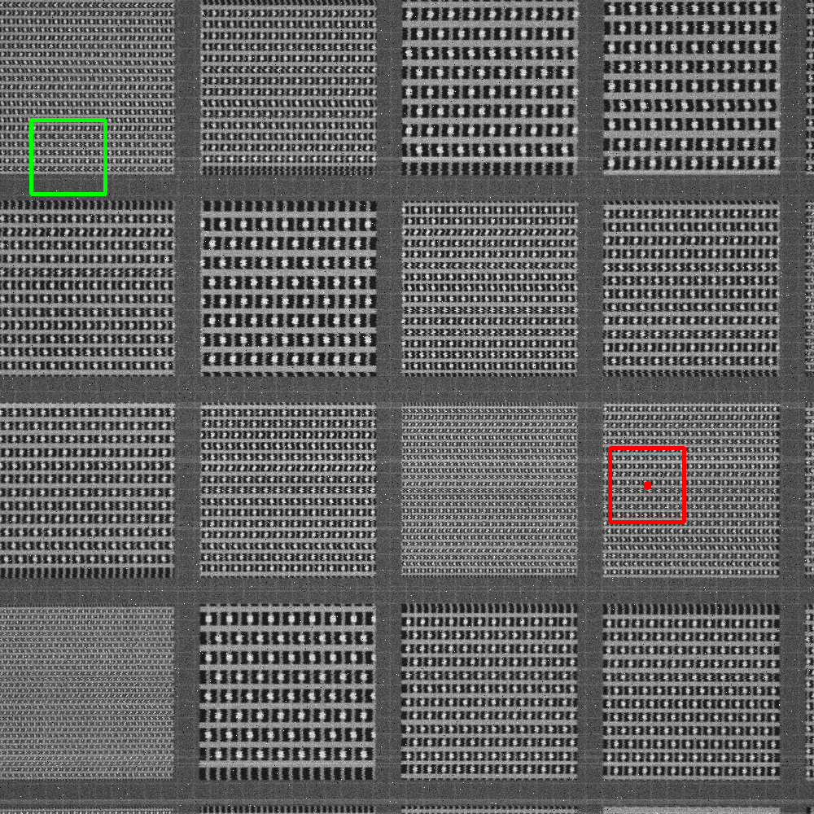
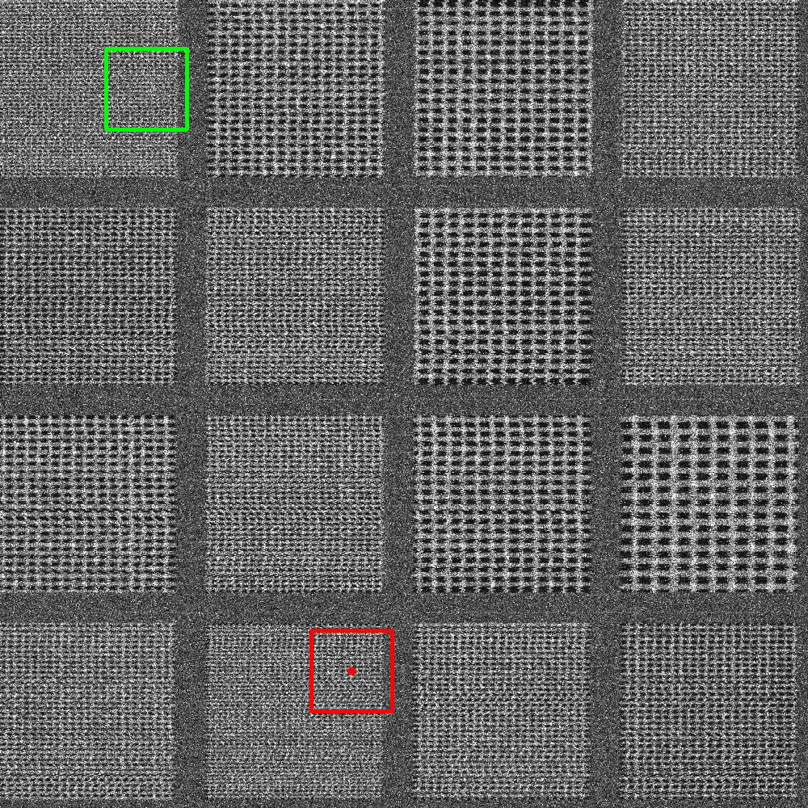
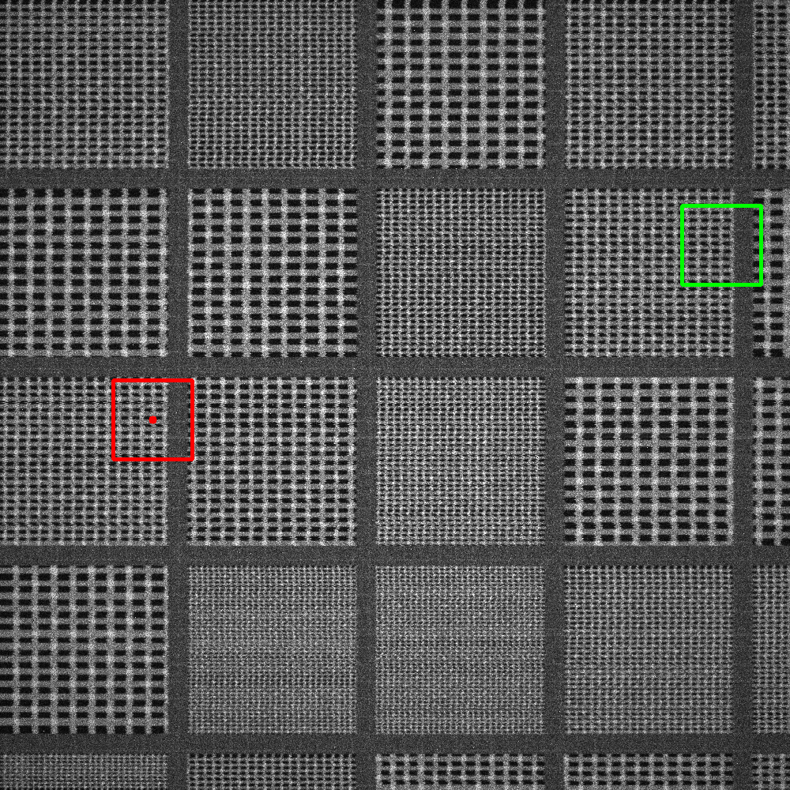

## failure 50 (finfet_14nm, medium, scale 11.000, rot 0.000)
error 817.683 px, ZNCC score 0.676, model prob 0.542. Green = GT, red = prediction.

Root cause: repeated-pattern ambiguity resolved in favour of a periodic duplicate

## failure 6 (dram_1x, severe, scale 10.000, rot 0.000)
error 763.889 px, ZNCC score 0.395, model prob 0.543. Green = GT, red = prediction.

Root cause: low-SNR search image (high/severe noise level)

## failure 34 (dram_1x, high, scale 10.000, rot 0.000)
error 753.404 px, ZNCC score 0.700, model prob 0.587. Green = GT, red = prediction.

Root cause: low-SNR search image (high/severe noise level)

