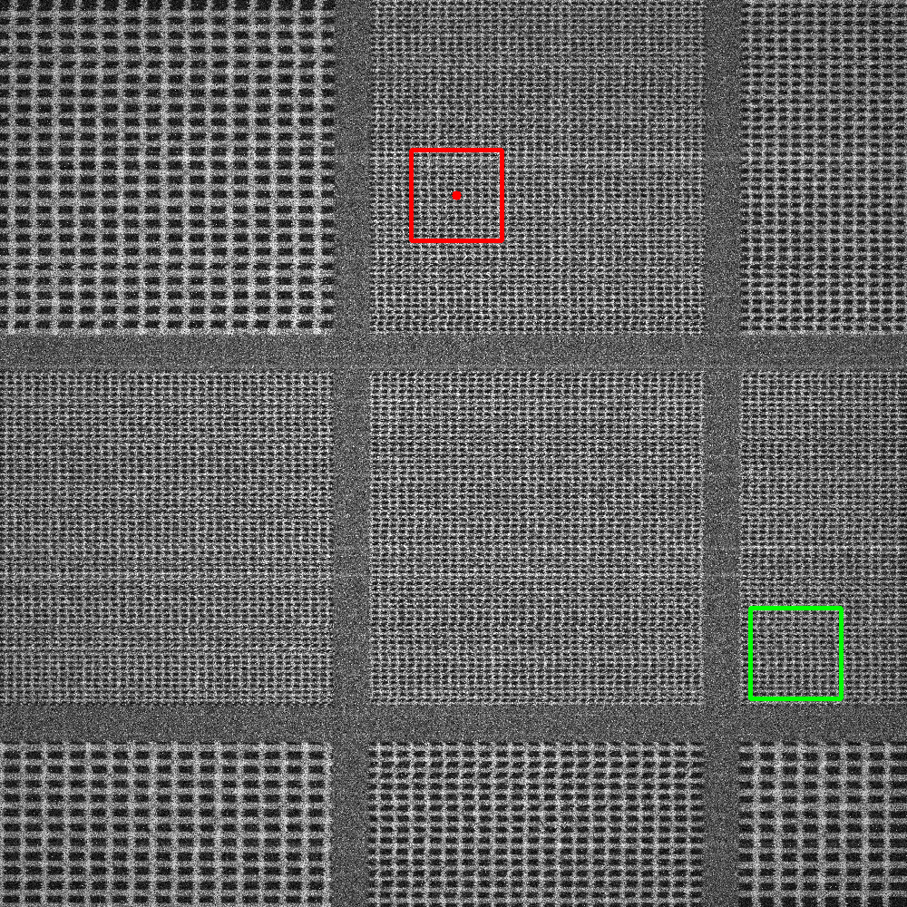
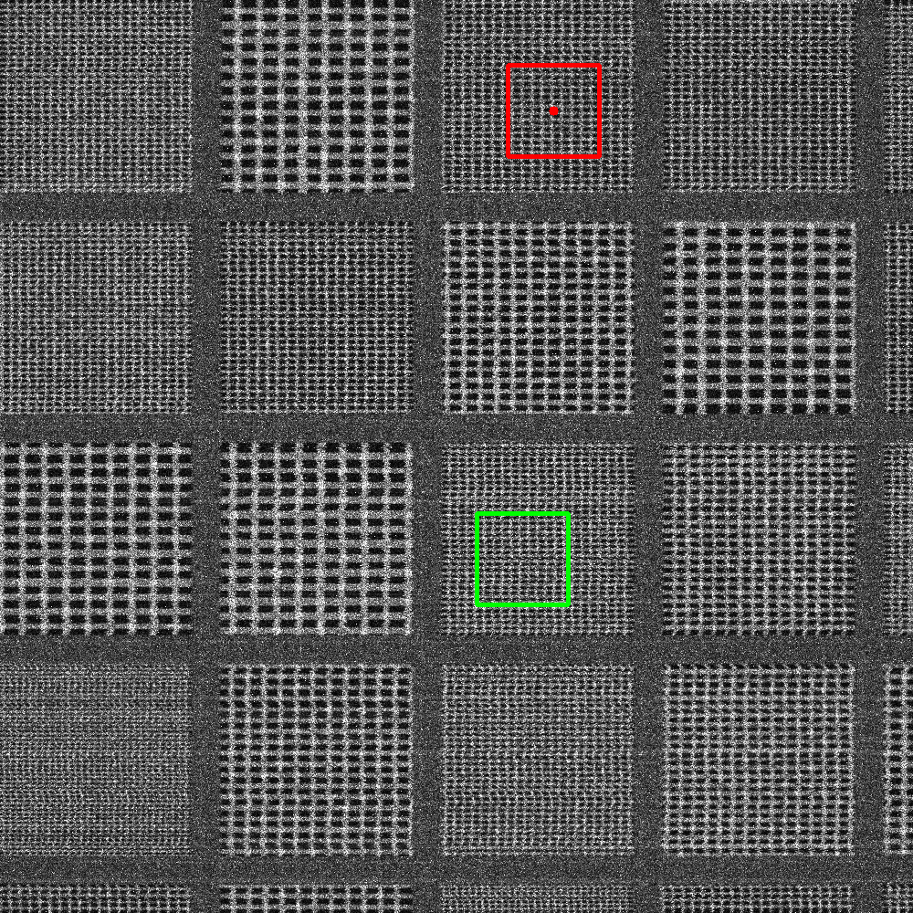
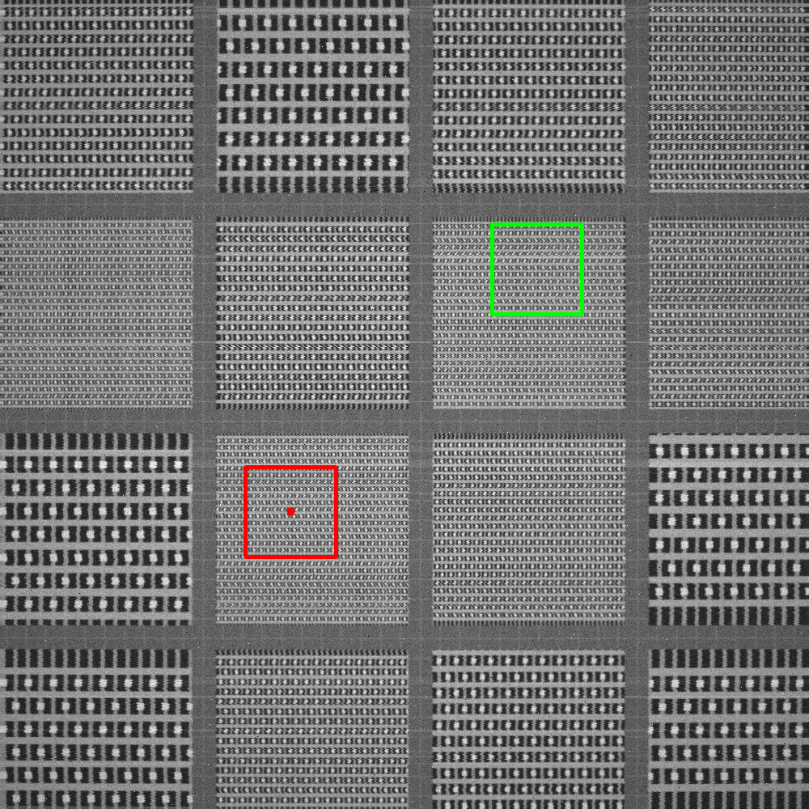

## failure 54 (dram_dense, severe, scale 10.000, rot 0.000)
error 628.853 px, ZNCC score 0.622, model prob 0.558. Green = GT, red = prediction.

Root cause: low-SNR search image (high/severe noise level)

## failure 48 (dram_loose, severe, scale 10.000, rot 0.000)
error 492.657 px, ZNCC score 0.615, model prob 0.535. Green = GT, red = prediction.

Root cause: low-SNR search image (high/severe noise level)

## failure 52 (finfet_10nm, medium, scale 9.000, rot 0.000)
error 427.221 px, ZNCC score 0.719, model prob 0.550. Green = GT, red = prediction.

Root cause: repeated-pattern ambiguity resolved in favour of a periodic duplicate

